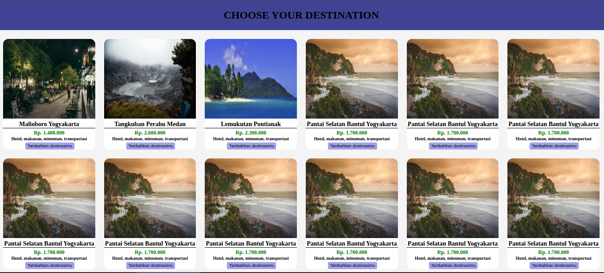

# Example of card destination product using javascript
> 09-03-2026

--------------------

## Overview 🎯

I create the product card image using javascript instead of HTML5 and i just provided the container on HTML5.
Inside the card product we have image, destiantion's name, price, what will you get when you hit the destinations(include), and also button.

| Technologies | Description |
| --- | --- |
| HTML5 | create the container 0f cards |
| CSS | make the ui/ux looks more captivating |
| JAVASCRIPT | for image looping |

--------------------

### Screenshot of the website 

[Destination card product](https://github.com/Kevin12er/Destination-card.git) 

